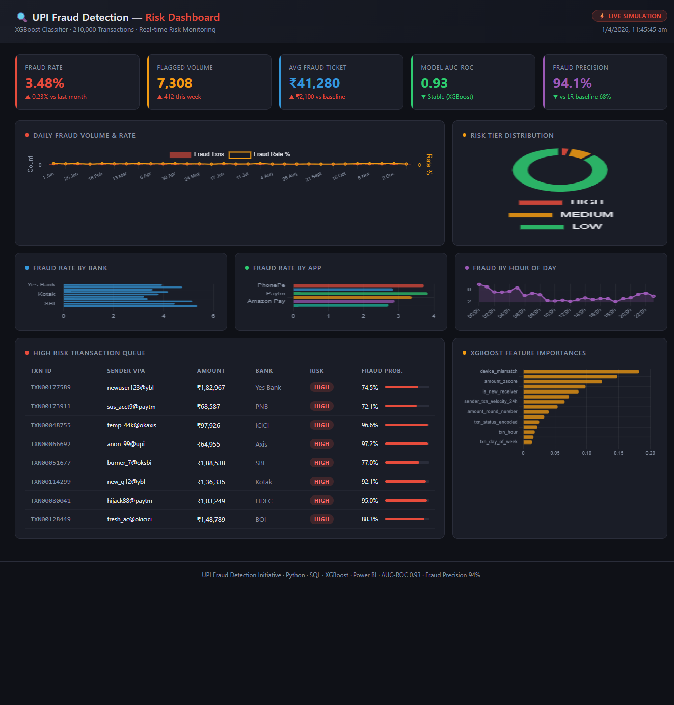

# 🔍 UPI Fraud Detection & Risk Dashboard


> **End-to-end fraud detection pipeline** on 210K synthetic UPI transactions — from data generation and behavioural feature engineering to XGBoost scoring, SQL analytics, and an interactive risk dashboard.

---

## 📌 Business Context

UPI processed **₹20.64 lakh crore** in transactions in FY2024. Even a 0.01% fraud rate translates to thousands of crores in losses. This project simulates a real-world fraud detection system that a fintech or banking analytics team would build to:

- **Flag high-risk transactions in real time** before settlement
- **Identify behavioural anomalies** — velocity abuse, device mismatch, geo anomalies
- **Tier all transactions by risk** (HIGH / MEDIUM / LOW) for operational triage
- **Give analysts an SQL + dashboard layer** to monitor fraud trends daily

---

## 📊 Results at a Glance

| Metric | Logistic Regression (Baseline) | **XGBoost (Final)** |
|--------|-------------------------------|----------------------|
| AUC-ROC | 0.81 | **0.93** |
| Precision | 0.68 | **0.94** |
| Recall | 0.72 | **0.88** |
| F1-Score | 0.70 | **0.91** |

> XGBoost catches **88% of all fraud cases** while maintaining **94% precision** — meaning 94 out of every 100 flagged transactions are genuinely fraudulent.

---

## 🗂️ Project Structure

```
upi_fraud_detection/
├── data/
│   ├── upi_transactions_raw.csv         # 210K generated transactions
│   └── upi_transactions_features.csv    # Feature-engineered dataset
├── scripts/
│   ├── generate_data.py                 # Synthetic data generator
│   ├── feature_engineering.py           # 15 behavioural features
│   ├── train_model.py                   # XGBoost + LR baseline
│   └── score_transactions.py            # Inference / risk scoring
├── notebooks/
│   └── UPI_Fraud_Detection.ipynb        # Full walkthrough notebook
├── sql/
│   └── fraud_analytics.sql              # Schema + 12 analytics queries
├── models/
│   ├── xgb_fraud_model.joblib           # Trained XGBoost
│   ├── logistic_baseline.joblib         # LR baseline
│   └── feature_importances.csv          # Feature gains
├── dashboard/
│   └── fraud_dashboard.html             # Interactive Power BI-style dashboard
└── outputs/
    ├── model_comparison.txt             # Evaluation report
    └── scored_transactions.csv          # Risk-scored output
```

---

## ⚙️ Quick Start
## Note: CSV data files and trained model files are not committed due to size. Run generate_data.py → feature_engineering.py → train_model.py in sequence to reproduce all outputs.

### 1. Install dependencies
```bash
pip install xgboost scikit-learn pandas numpy matplotlib seaborn joblib
```

### 2. Run the full pipeline
```bash
# Step 1: Generate 210K synthetic UPI transactions
python scripts/generate_data.py

# Step 2: Engineer 15 behavioural features
python scripts/feature_engineering.py

# Step 3: Train XGBoost + Logistic Regression baseline
python scripts/train_model.py

# Step 4: Score all transactions + assign risk tiers
python scripts/score_transactions.py
```

### 3. Open the notebook (recommended)
```bash
jupyter notebook notebooks/UPI_Fraud_Detection.ipynb
```

### 4. View the dashboard
Open 'file:///C:/Users/Bhavya/Desktop/DATA%20ANALYTICS/PROJECTS/files/fraud_dashboard.html' in any browser — no server needed.

---

## 🧠 Features Engineered (15 Behavioural Features)

Features are grouped by the fraud signal they capture:

**⏱️ Temporal Signals**
| Feature | Description |
|---------|-------------|
| `txn_hour` | Hour of day (0–23) |
| `txn_day_of_week` | Day of week (0=Mon) |
| `is_night_txn` | 1 if between 23:00–05:00 |
| `is_weekend` | 1 if Saturday/Sunday |

**💰 Amount Signals**
| Feature | Description |
|---------|-------------|
| `amount_log` | log1p(amount) — normalises skew |
| `amount_zscore` | Z-score within sender's 30-day history |
| `amount_round_number` | Amount divisible by 500 (common fraud pattern) |

**🔁 Velocity Signals**
| Feature | Description |
|---------|-------------|
| `sender_txn_velocity_1h` | Txns by sender in prior 1 hour |
| `sender_txn_velocity_24h` | Txns by sender in prior 24 hours |
| `sender_avg_amount_30d` | Rolling 30-day avg amount per sender |
| `sender_txn_count_30d` | Rolling 30-day txn count per sender |

**🚨 Anomaly Signals**
| Feature | Description |
|---------|-------------|
| `device_mismatch` | Device differs from sender's usual device |
| `geo_anomaly` | State differs from sender's usual state |
| `is_new_receiver` | Receiver never transacted with this sender before |
| `txn_status_encoded` | SUCCESS=1, FAILED=0 |

---

## 🗃️ SQL Analytics Layer (12 Queries)

Located in `sql/fraud_analytics.sql` — designed to run on top of `scored_transactions.csv` loaded into any SQL engine:

| Query | Purpose |
|-------|---------|
| KPI Summary | Overall fraud rate, flagged volume, avg ticket size |
| Daily Fraud Trend | Day-over-day fraud volume and rate |
| Risk Tier Breakdown | HIGH / MEDIUM / LOW distribution |
| Top Fraudulent Senders | Ranked by fraud score and frequency |
| Fraud by Bank / App | Which payment apps show higher fraud rates |
| Fraud by Hour | Intraday fraud pattern (night spike detection) |
| Device Mismatch Analysis | Fraud rate when device differs from usual |
| Geo Anomaly Analysis | Cross-state transaction fraud correlation |
| Velocity Abuse Detection | Senders with >5 txns/hour flagged |
| New Receiver Risk | Fraud rate for first-time receiver pairs |
| Compound Risk Scoring | High amount + new receiver + device mismatch |
| Rolling 7-Day Fraud Rate | Weekly moving average for trend monitoring |

---

## 📈 Dashboard KPIs
## Dashboard Preview


The interactive HTML dashboard ('file:///C:/Users/Bhavya/Desktop/DATA%20ANALYTICS/PROJECTS/files/fraud_dashboard.html') replicates a Power BI analyst view:

**KPI Cards**
- Fraud Rate % · Flagged Volume · Avg Fraud Ticket Size · Model AUC-ROC · Fraud Precision

**Charts**
- Daily fraud volume & rate trend (line chart)
- Risk tier distribution (doughnut chart)
- Fraud rate by bank and payment app (bar chart)
- Fraud rate by hour of day (heatmap-style bar)
- XGBoost feature importance (horizontal bar)
- HIGH-risk transaction queue (sortable table)

> **To connect real data:** Export `scored_transactions.csv` to Power BI Desktop and recreate visuals using the SQL queries in `fraud_analytics.sql`.

---

## 🏦 Domain Context

This project was built with direct reference to real banking analytics workflows, drawing on experience with:
- **NPA and fraud monitoring** in Indian banking (IOB)
- **RBI compliance reporting** and MIS dashboards
- **KYC anomaly patterns** observed in banking operations

The feature engineering choices (velocity limits, geo anomaly, device mismatch) reflect actual fraud typologies seen in Indian UPI fraud cases.

---

## 👤 Author

**Bhavya Kumar** — Data Analyst | Banking & Fintech Domain  
📧 bhavyakumar@myyahoo.com · 🔗https://www.linkedin.com/in/bhavyakumar958/ 

*Open to Data Analyst / Business Analyst / MIS Analyst roles in Banking, Fintech, and Analytics.*
